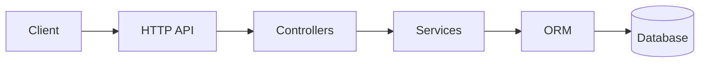

# Codebase Onboarding

## Overview

Systematic methodology for exploring and documenting an unfamiliar codebase. This skill produces a **Project Landscape Document** covering: directory structure, dependency graph, configuration files, entry points, data flow, test architecture, and architectural patterns — all in a structured markdown report.

## When to Use

- Starting work on a project you've never seen before
- Joining a new team or taking over a legacy project
- Performing due diligence before a refactor or migration
- Writing architecture documentation for an undocumented codebase
- Preparing onboarding materials for new developers
- Auditing a project's structure for security or compliance reviews

## Workflow

### Phase 1: Reconnaissance (10 min)

Start with high-level structure, then drill in.

```bash
# 1. Top-level directory tree
ls -la

# 2. Language detection via file extension census
# Python
find . -name '*.py' -not -path '*/venv/*' -not -path '*/.git/*' -not -path '*/node_modules/*' -not -path '*/__pycache__/*' | head -5
# JavaScript/TypeScript
find . -name '*.{js,ts,jsx,tsx}' -not -path '*/node_modules/*' -not -path '*/.git/*' | head -5
# Rust
find . -name '*.rs' -not -path '*/target/*' -not -path '*/.git/*' | head -5
# Go
find . -name '*.go' -not -path '*/vendor/*' -not -path '*/.git/*' | head -5

# 3. Count files by extension for a quick language profile
find . -type f -not -path '*/node_modules/*' -not -path '*/.git/*' \
  -not -path '*/venv/*' -not -path '*/__pycache__/*' -not -path '*/target/*' \
  | sed 's/.*\.//' | sort | uniq -c | sort -rn | head -20

# 4. Config files discovery
find . -maxdepth 3 \( -name '*.json' -o -name '*.yaml' -o -name '*.yml' \
  -o -name '*.toml' -o -name '*.cfg' -o -name '*.ini' -o -name '.env*' \
  -o -name 'Makefile' -o -name 'Dockerfile' -o -name 'docker-compose*' \
  -o -name '*.gradle' -o -name 'pom.xml' -o -name 'Cargo.toml' \
  -o -name 'go.mod' -o -name 'package.json' -o -name 'setup.py' \
  -o -name 'pyproject.toml' -o -name 'Gemfile' \) \
  | grep -v node_modules | grep -v .git | sort
```

### Phase 2: Build & Dependency Analysis

```bash
# Python — list installed packages
pip list --format=columns 2>/dev/null || pip3 list --format=columns

# Node.js — extract deps from package.json
cat package.json | python3 -c \
  "import json,sys; d=json.load(sys.stdin); \
  print('Dependencies:', json.dumps(d.get('dependencies',{}), indent=2)); \
  print('DevDep:', json.dumps(d.get('devDependencies',{}), indent=2))"

# Rust
cargo metadata --format-version=1 | python3 -c \
  "import json,sys; m=json.load(sys.stdin); \
  [print(p['name'], p['version']) for p in m['packages']]" | head -40

# Go
go list -m all | head -40

# Build commands from Makefile or package.json
grep -E '^(build|test|lint|run|deploy|start|dev|serve|check|format)' Makefile 2>/dev/null \
  || echo "No standard targets found"
python3 -c "import json; d=json.load(open('package.json')); \
  [print(k, '\u2192', v) for k,v in d.get('scripts',{}).items()]" 2>/dev/null
```

### Phase 3: Entry Points & Module Architecture

Map the application's runtime entry points:

```python
#!/usr/bin/env python3
"""Discover entry points in a project."""
import os

entry_points = {
    'python': ['__main__.py', 'main.py', 'app.py', 'cli.py', 'manage.py',
               'wsgi.py', 'asgi.py', 'setup.py'],
    'node': ['index.js', 'index.ts', 'server.js', 'app.js', 'cli.js', 'bin/'],
    'general': ['Dockerfile', 'docker-compose.yml', 'Procfile', 'serverless.yml']
}

found = []
for root, dirs, files in os.walk('.'):
    skip_dirs = ['node_modules', '.git', '__pycache__', 'venv', 'target',
                 'vendor', '.venv', 'dist', 'build']
    if any(p in root.replace(os.sep, '/').split('/') for p in skip_dirs):
        continue
    depth = root.replace(os.sep, '/').count('/')
    if depth > 4:
        continue
    for f in files:
        if f in entry_points['python'] or f in entry_points['node'] or f in entry_points['general']:
            found.append(os.path.join(root, f))
    if 'bin' in os.path.basename(root):
        for f in files:
            found.append(os.path.join(root, f))

print('\n'.join(sorted(found)))
```

### Phase 4: Configuration Discovery & Schema

```bash
# Collect all config files
find . -maxdepth 4 \( -name '*.yaml' -o -name '*.yml' -o -name '*.toml' \
  -o -name '*.json' -o -name '.env*' -o -name '*.cfg' -o -name '*.ini' \
  -o -name '*.conf' \) -not -path '*/node_modules/*' -not -path '*/.git/*' \
  -not -path '*/venv/*' -not -path '*/target/*' | sort

# Map environment variables used in code
grep -rh --include='*.py' --include='*.js' --include='*.ts' --include='*.go' \
  --include='*.rs' -E "(os\.environ|os\.getenv|process\.env|os\.Environ|std::env::var)\(['\"]([A-Z_]+)" . \
  | grep -oE "['\"][A-Z_]+['\"]" | tr -d "'\"" | sort -u | head -40
```

### Phase 5: Dependency Graph Construction

```bash
# Python import graph
grep -rh --include='*.py' -E '^(import |from )' . \
  | sed 's/from \([^ ]*\) import.*/\1/' \
  | sed 's/import \([^ ]*\).*/\1/' \
  | sed 's/\s*#.*//' \
  | grep -vE '^(#|$)' \
  | sort -u | head -60

# JavaScript/TypeScript require/import graph
grep -rh --include='*.{js,ts,jsx,tsx}' -E "(require\(|from ['\"])" . \
  | grep -oE "['\"]([^'\"]+)" | tr -d "'\"" \
  | grep -vE '^(\.|node_modules)' | sort -u | head -60
```

### Phase 6: Test Architecture Discovery

```bash
# Find all test files
find . -type f \( -name 'test_*' -o -name '*_test.*' -o -name '*.test.*' \
  -o -name '*.spec.*' -o -name '*_test.go' -o -name '*_test.rs' \) \
  -not -path '*/node_modules/*' -not -path '*/.git/*' -not -path '*/venv/*' | sort

# Detect test framework imports
grep -rh --include='*.py' -E '^(import |from )' . \
  | grep -iE 'pytest|unittest|nose|doctest' | sort -u

# Calculate test-to-source ratio
echo "Source files: $(find . -name '*.py' -not -path '*/venv/*' -not -path '*/.git/*' | wc -l)"
echo "Test files: $(find . \( -name 'test_*' -o -name '*_test.py' \) \
  -not -path '*/venv/*' -not -path '*/.git/*' | wc -l)"
```

### Phase 7: Produce the Project Landscape Document

Generate this structured markdown report:

```markdown
# Project Landscape: <Project Name>

## Overview
- **Language(s):** <detected>
- **Build System:** <Makefile, Cargo, npm, Gradle>
- **Test Framework:** <pytest, jest, go test>
- **Package Manager:** <pip, npm, cargo, yarn>
- **CI/CD:** <GitHub Actions, Jenkins, CircleCI>
- **Deployment:** <Docker, serverless, bare metal>
- **Database:** <PostgreSQL, MySQL, SQLite, MongoDB>

## Directory Structure

```
<full tree output, depth 2-3>
```

## Entry Points
| File | Purpose |
|------|---------|
| `main.py` | Application bootstrap |

## Dependencies (key)
| Package | Version | Purpose |
|---------|---------|---------|
| Flask | 2.3.x | Web framework |

## Configuration
| File | Format | Key Settings |
|------|--------|--------------|
| config.yaml | YAML | database_url, log_level |

## Data Flow


## Test Architecture
| Area | Count | Framework |
|------|-------|-----------|
| Unit tests | 142 | pytest |

## Key Observations
- **Pattern:** MVC / Clean Architecture / Hexagonal
- **Notable:** unusual decisions or bright spots
- **Risks:** areas needing attention
```

## Common Pitfalls

- **Over-exploration**: Don't read every file. Start with 10-20 key files, then zoom out.
- **Ignoring the build system**: Build files (Makefile, package.json scripts) tell you how the project runs. Check them first.
- **Skipping tests**: Tests are the best documentation of intended behavior. Read a few before diving into implementation.
- **Assuming architecture consistency**: Most real projects mix patterns. Document what's actually there.
- **Missing generated code**: Look for protobuf, gRPC stubs, GraphQL types, Prisma client, or code-gen output.
- **Forgetting prerequisites**: Document runtime/tools needed (Python 3.11+, Node 20+) and system deps (libpq, openssl).
- **Stale documentation**: If docs exist, verify they match reality. Code and config are source of truth.

## Verification Checklist

- [ ] Top-level directory structure documented
- [ ] Build system identified
- [ ] All config files discovered and key settings extracted
- [ ] Entry points identified (main, CLI, server, workers)
- [ ] Dependency list generated (top 20 direct deps)
- [ ] Test framework and coverage level determined
- [ ] Import/require graph generated (high-level)
- [ ] CI/CD pipeline identified
- [ ] Docker/deployment setup documented
- [ ] Environment variables cataloged
- [ ] Project Landscape document written to docs/
