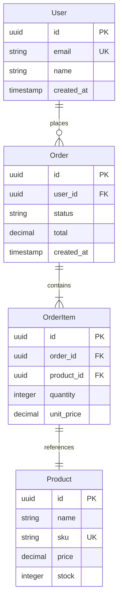

# Database Schema Design

## Overview

Systematic approach to relational database schema design covering: domain entity discovery, relationship mapping, normalization through 3NF, index strategy development, query pattern analysis, migration planning, and ER diagram generation using Mermaid. Applicable to PostgreSQL, MySQL, SQLite, and other SQL databases.

## When to Use

- Designing a new database schema from scratch
- Reviewing and normalizing an existing schema
- Planning indexes for query performance
- Generating ER diagrams for documentation
- Planning database migrations for a new feature
- Refactoring a poorly normalized schema

## Workflow

### Phase 1: Domain Entity Discovery

Extract candidate entities from requirements, existing code, or API specs:

```bash
# From existing Python models (SQLAlchemy, Django, Pydantic)
grep -rh --include='*.py' -E '^class \w+\((Base|Model|db\.Model|SQLModel|Table)\)' . | head -30

# From TypeScript/JS interfaces or types
grep -rh --include='*.ts' --include='*.js' -E '^(export )?interface \w+' . | head -30

# From OpenAPI spec components
python3 -c "
import json, sys
spec = json.load(open(sys.argv[1]))
for name, schema in spec.get('components',{}).get('schemas',{}).items():
    if schema.get('type') == 'object':
        print(f'{name}: {list(schema.get(\"properties\",{}).keys())}')
" openapi.json 2>/dev/null || echo "No OpenAPI spec found"
```

**Entity identification checklist:**
- [ ] Nouns in the domain vocabulary (User, Order, Product, Invoice)
- [ ] Each entity has a natural unique identifier
- [ ] Each entity has attributes that describe it
- [ ] Entities relate to other entities in the domain

### Phase 2: Relationship Mapping

Map relationships between entities with cardinality:



**Cardinality notation:**
| Symbol | Meaning |
|--------|---------|
| `||--||` | One-to-one (1:1) |
| `||--o{` | One-to-many (1:N) |
| `}|--o{` | Many-to-many (M:N) |
| `o{` | Zero or more (optional many) |
| `||` | Exactly one (required) |
| `o|` | Zero or one (optional one) |

**Relationship conventions:**
- **1:N** — Add foreign key on the "many" side referencing the "one" side
- **M:N** — Create a join table with FKs to both parent tables
- **1:1** — Add FK on either side with UNIQUE constraint; or share primary key

### Phase 3: Normalization (1NF → 3NF)

```sql
-- UNF (Unnormalized) — DON'T do this
CREATE TABLE orders_unf (
    id UUID PRIMARY KEY,
    customer_name TEXT,
    customer_email TEXT,
    items TEXT,  -- comma-separated: "SKU1,SKU2,SKU3"
    prices TEXT  -- comma-separated: "10.00,15.00,12.50"
);

-- 1NF: Atomic columns, no repeating groups
CREATE TABLE orders_1nf (
    id UUID,
    customer_name TEXT,
    customer_email TEXT,
    item_sku TEXT,
    item_price DECIMAL(10,2),
    PRIMARY KEY (id, item_sku)
);

-- 2NF: Remove partial dependencies (depends on PART of composite key)
-- Items don't depend on order id alone → extract to items table
CREATE TABLE orders_2nf (
    id UUID PRIMARY KEY,
    customer_name TEXT,
    customer_email TEXT
);
CREATE TABLE order_items_2nf (
    order_id UUID REFERENCES orders_2nf(id),
    item_sku TEXT,
    item_price DECIMAL(10,2),
    PRIMARY KEY (order_id, item_sku)
);

-- 3NF: Remove transitive dependencies (non-key depends on another non-key)
-- customer_name, customer_email depend on customer, not order
CREATE TABLE customers (
    id UUID PRIMARY KEY,
    name TEXT NOT NULL,
    email TEXT UNIQUE NOT NULL
);
CREATE TABLE orders (
    id UUID PRIMARY KEY,
    customer_id UUID REFERENCES customers(id),
    status TEXT DEFAULT 'pending',
    created_at TIMESTAMPTZ DEFAULT NOW()
);
CREATE TABLE order_items (
    id UUID PRIMARY KEY DEFAULT gen_random_uuid(),
    order_id UUID REFERENCES orders(id),
    product_id UUID REFERENCES products(id),
    quantity INT NOT NULL CHECK (quantity > 0),
    unit_price DECIMAL(10,2) NOT NULL
);
CREATE TABLE products (
    id UUID PRIMARY KEY,
    name TEXT NOT NULL,
    sku TEXT UNIQUE NOT NULL,
    price DECIMAL(10,2) NOT NULL,
    stock INT NOT NULL DEFAULT 0
);
```

### Phase 4: Data Types & Constraints

```sql
-- PostgreSQL recommended data types
CREATE TABLE data_type_guide (
    -- Identifiers
    id UUID PRIMARY KEY DEFAULT gen_random_uuid(),           -- Public IDs
    serial_id BIGSERIAL,                                     -- Internal auto-increment

    -- Strings
    name VARCHAR(100) NOT NULL,                              -- Bounded text
    description TEXT,                                        -- Unbounded text
    email CITEXT UNIQUE,                                     -- Case-insensitive (PG contrib)
    slug VARCHAR(200) UNIQUE,                                -- URL-safe identifier

    -- Numeric
    price DECIMAL(10,2) NOT NULL,                            -- Monetary (avoid FLOAT!)
    quantity INTEGER CHECK (quantity >= 0),
    rating NUMERIC(2,1) CHECK (rating >= 0 AND rating <= 5),-- Decimal with constraints
    metadata JSONB DEFAULT '{}',                             -- Flexible attributes

    -- Temporal
    created_at TIMESTAMPTZ NOT NULL DEFAULT NOW(),
    updated_at TIMESTAMPTZ NOT NULL DEFAULT NOW(),
    deleted_at TIMESTAMPTZ,                                  -- Soft delete
    birth_date DATE,
    expires_in INTERVAL,

    -- Boolean
    is_active BOOLEAN NOT NULL DEFAULT true,

    -- Enum (prefer TEXT with CHECK over native enum for flexibility)
    status TEXT NOT NULL DEFAULT 'pending'
        CHECK (status IN ('pending', 'active', 'suspended', 'archived'))
);

-- Constraints best practices
ALTER TABLE orders ADD CONSTRAINT fk_orders_customer
    FOREIGN KEY (customer_id) REFERENCES customers(id)
    ON DELETE RESTRICT;  -- Prevent orphan orders (use RESTRICT, not CASCADE or SET NULL)

ALTER TABLE order_items ADD CONSTRAINT fk_order_items_order
    FOREIGN KEY (order_id) REFERENCES orders(id)
    ON DELETE CASCADE;  -- Items die with the order

ALTER TABLE customers ADD CONSTRAINT chk_customer_email
    CHECK (email ~* '^[A-Za-z0-9._%-]+@[A-Za-z0-9.-]+[.][A-Za-z]{2,}$');
```

### Phase 5: Index Strategy

```sql
-- B-Tree indexes (default — good for equality, range, sort)
CREATE INDEX idx_orders_customer_id ON orders(customer_id);           -- FK lookups
CREATE INDEX idx_orders_created_at ON orders(created_at DESC);        -- Recent-first list
CREATE UNIQUE INDEX idx_products_sku ON products(sku);                -- Uniqueness + lookup

-- Composite indexes (column order matters: equality first, then range)
CREATE INDEX idx_orders_customer_status ON orders(customer_id, status);-- WHERE customer_id=X AND status=Y
CREATE INDEX idx_orders_status_created ON orders(status, created_at); -- WHERE status=X ORDER BY created_at

-- Partial indexes (for frequent filtered queries)
CREATE INDEX idx_orders_active ON orders(created_at)
    WHERE status NOT IN ('cancelled', 'archived');

-- Covering indexes (INCLUDE non-search columns to avoid heap lookups)
CREATE INDEX idx_users_email_covering ON users(email)
    INCLUDE (name, avatar_url);  -- SELECT name, avatar_url FROM users WHERE email = ?

-- Full-text search
CREATE INDEX idx_products_search ON products
    USING GIN(to_tsvector('english', name || ' ' || COALESCE(description, '')));

-- GIN for JSONB queries
CREATE INDEX idx_metadata ON orders USING GIN(metadata);

-- BRIN for very large, naturally-ordered tables
CREATE INDEX idx_logs_created_at ON audit_logs USING BRIN(created_at)
    WITH (pages_per_range = 32);
```

**Index rules of thumb:**
- Index foreign key columns (every FK needs an index)
- Index columns in WHERE, JOIN, ORDER BY, GROUP BY clauses
- Composite index column order: high-cardinality equality first, then range
- Avoid indexing boolean/low-cardinality columns alone (useless)
- Partial indexes are smaller and faster than full indexes
- Use `EXPLAIN ANALYZE` to validate index usage
- Don't over-index — each index slows writes

### Phase 6: Query Pattern Analysis

```bash
# PostgreSQL: Find slow queries
SELECT queryid, calls, mean_exec_time, rows, query
FROM pg_stat_statements
ORDER BY mean_exec_time DESC
LIMIT 20;

# PostgreSQL: Find most-called queries
SELECT queryid, calls, total_exec_time, rows, query
FROM pg_stat_statements
ORDER BY calls DESC
LIMIT 20;

# PostgreSQL: Find tables with missing indexes
SELECT schemaname, tablename, seq_scan, seq_tup_read,
       idx_scan, idx_tup_fetch
FROM pg_stat_user_tables
WHERE seq_scan > idx_scan * 2
ORDER BY seq_scan DESC;
```

### Phase 7: Migration Planning

```python
"""
Migration workflow with Alembic (Python):
"""
# 1. Generate migration
# alembic revision --autogenerate -m "add orders table"

# 2. Review generated migration
"""alembic/versions/abc123_add_orders.py"""
from alembic import op
import sqlalchemy as sa

def upgrade():
    op.create_table(
        'orders',
        sa.Column('id', sa.UUID(), nullable=False),
        sa.Column('customer_id', sa.UUID(), nullable=False),
        sa.Column('status', sa.String(20), nullable=False, server_default='pending'),
        sa.Column('total', sa.Numeric(10, 2), nullable=False, server_default='0.00'),
        sa.Column('created_at', sa.DateTime(timezone=True), server_default=sa.func.now()),
        sa.PrimaryKeyConstraint('id'),
        sa.ForeignKeyConstraint(['customer_id'], ['customers.id'], ondelete='RESTRICT'),
    )
    op.create_index('idx_orders_customer_id', 'orders', ['customer_id'])
    op.create_index('idx_orders_created_at', 'orders', ['created_at'])

def downgrade():
    op.drop_table('orders')

# 3. Apply
# alembic upgrade head
```

**Migration best practices:**

```bash
# Always generate a SQL preview before running in production
alembic upgrade head --sql > preview.sql

# Backfill data in batches (never in one transaction)
"""
-- For large tables: backfill in chunks
WITH batch AS (
    SELECT id FROM orders WHERE status IS NULL LIMIT 1000
    FOR UPDATE SKIP LOCKED
)
UPDATE orders SET status = 'pending'
WHERE id IN (SELECT id FROM batch);
"""

# Zero-downtime migration patterns:
# 1. Expand: Add new column (nullable, no NOT NULL)
# 2. Migrate: Backfill data in batches
# 3. Contract: Add NOT NULL constraint, drop old column
```

### Phase 8: ER Diagram Generation

Generate Mermaid ER diagrams from existing schemas:

```python
#!/usr/bin/env python3
"""Generate Mermaid ER diagram from database metadata."""
import subprocess

# PostgreSQL: extract tables and relationships
query = """
SELECT
    tc.table_schema,
    tc.table_name,
    kcu.column_name,
    ccu.table_schema AS foreign_schema,
    ccu.table_name AS foreign_table,
    ccu.column_name AS foreign_column
FROM information_schema.table_constraints tc
JOIN information_schema.key_column_usage kcu
    ON tc.constraint_name = kcu.constraint_name
JOIN information_schema.constraint_column_usage ccu
    ON ccu.constraint_name = tc.constraint_name
WHERE tc.constraint_type = 'FOREIGN KEY'
  AND tc.table_schema = 'public';
"""

# Generate diagram
print("```mermaid")
print("erDiagram")
print("    User ||--o{ Order : places")
print("    Order ||--|{ OrderItem : contains")
print("    OrderItem ||--|| Product : references")
print("```")
```

## Common Pitfalls

- **Not using UUIDs for public IDs**: Auto-increment integers leak entity counts and enable enumeration attacks. Use UUIDs for all public-facing identifiers.
- **FLOAT for money**: Never use FLOAT/REAL for monetary values. Use DECIMAL(precision, scale) or NUMERIC.
- **Missing foreign key indexes**: Every FK column needs an explicit index. Most DBs don't auto-index FKs.
- **Over-normalization**: 3NF is usually sufficient. Beyond that (BCNF, 4NF, 5NF) is rare and can harm performance.
- **Not using CHECK constraints**: Enforce domain integrity at the database level, not just in application code.
- **Nullable columns without good reason**: NULL means "unknown", not "empty" or "not applicable". Use NOT NULL with sensible defaults.
- **Native ENUM types**: They're hard to alter. Use TEXT + CHECK constraints instead for flexibility.
- **No migration strategy**: Schema changes should be version-controlled, reviewed, and reversible. Use migration tools (Alembic, Flyway, Prisma Migrate).
- **Not considering query patterns**: Design indexes based on actual queries, not just speculation. Profile first, index second.
- **Soft delete without filters**: If you use soft delete (`deleted_at`), every query must filter `WHERE deleted_at IS NULL` or use views.

## Verification Checklist

- [ ] All entities identified and documented
- [ ] Relationships mapped with correct cardinality (1:1, 1:N, M:N)
- [ ] Schema normalized to 3NF (no partial or transitive dependencies)
- [ ] UUID primary keys on all tables (not auto-increment integers)
- [ ] Data types chosen appropriately (DECIMAL for money, TIMESTAMPTZ for times)
- [ ] CHECK constraints enforce domain integrity
- [ ] Foreign keys have RESTRICT or CASCADE policies as appropriate
- [ ] Every FK column has an index
- [ ] Composite indexes designed with column order optimized for query patterns
- [ ] Partial or covering indexes considered for hot queries
- [ ] Migration plan written and reviewed
- [ ] ER diagram generated and shared with team
- [ ] Down migration tested (rollback works)
- [ ] `EXPLAIN ANALYZE` run on critical queries to validate index usage
